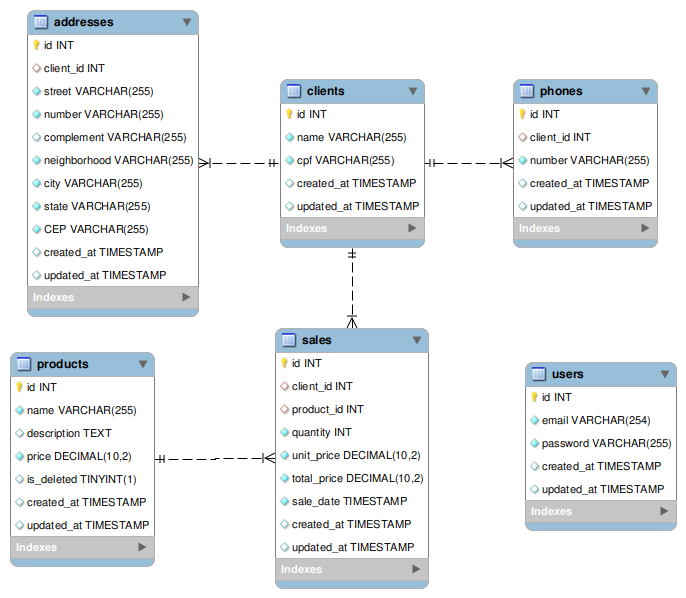

# Teste Técnico Back-end da BeTalent

## Descrição do Projeto

Este projeto consiste em estruturar uma API RESTful conectada a um banco de dados para gerenciar usuários, clientes, produtos e vendas. O sistema permite que usuários externos se cadastrem, façam login e, após autenticados, possam registrar e gerenciar clientes, produtos e vendas.

## Tecnologias Utilizadas

- **Framework**: AdonisJS (Node.js)
- **Banco de Dados**: MySQL
- **Autenticação**: JWT (JSON Web Token)

## Estrutura do Banco de Dados

O banco de dados está estruturado com as seguintes tabelas e relacionamentos:



## Relacionamentos

- **Clientes - Endereços**: Um cliente pode ter múltiplos endereços (Relacionamento 1:N).
- **Clientes - Telefones**: Um cliente pode ter múltiplos telefones (Relacionamento 1:N).
- **Clientes - Vendas**: Um cliente pode ter múltiplas vendas (Relacionamento 1:N).
- **Produtos - Vendas**: Um produto pode estar presente em múltiplas vendas (Relacionamento 1:N).

## Instalação e Configuração

### Requisitos

- Node.js
- MySQL

### Passos para Instalação

1. Clone o repositório:

    ```bash
    git clone <link_do_repositório>
    cd <nome_do_projeto>
    ```

2. Instale as dependências:

    ```bash
    npm install
    ```

3. Configure o banco de dados no arquivo `.env`:

    ```env
    DB_CONNECTION=mysql
    DB_HOST=127.0.0.1
    DB_PORT=3306
    DB_USER=<seu_usuario>
    DB_PASSWORD=<sua_senha>
    DB_DATABASE=<nome_do_banco_de_dados>
    ```

4. Execute as migrações:

    ```bash
    node ace migration:run
    ```

5. Inicie o servidor:

    ```bash
    npm start
    ```

## Rotas do Sistema

### Autenticação

#### Cadastro de Usuário

- **POST /api/users/signup**

**Body da Requisição:**

    ```json
    {
      "email": "usuario@example.com",
      "password": "senha123"
    }
    ```

#### Login de Usuário

- **POST /api/users/login**

**Body da Requisição:**

    ```json
    {
      "email": "usuario@example.com",
      "password": "senha123"
    }
    ```

### Clientes (Protegidas por autenticação)

#### Listar Todos os Clientes

- **GET /api/clients/list**

**Exemplo de Resposta:**

    ```json
    [
      {
        "id": 1,
        "name": "Cliente 1",
        "cpf": "123.456.789-00"
      },
      {
        "id": 2,
        "name": "Cliente 2",
        "cpf": "987.654.321-00"
      }
    ]
    ```

#### Detalhar um Cliente e Suas Vendas

- **GET /api/clients/:id**

**Exemplo de Resposta:**

    ```json
    {
      "id": 1,
      "name": "Cliente 1",
      "cpf": "123.456.789-00",
      "addresses": [
        {
          "id": 1,
          "street": "Rua A",
          "number": "123",
          "complement": "Apto 1",
          "neighborhood": "Bairro B",
          "city": "Cidade C",
          "state": "Estado D",
          "CEP": "12345-678"
        }
      ],
      "phones": [
        {
          "id": 1,
          "number": "(11) 98765-4321"
        }
      ],
      "sales": [
        {
          "id": 1,
          "product_id": 1,
          "quantity": 2,
          "unit_price": 100.00,
          "total_price": 200.00,
          "sale_date": "2024-01-01T00:00:00.000Z"
        }
      ]
    }
    ```

#### Adicionar um Novo Cliente

- **POST /api/clients/save**

**Body da Requisição:**

    ```json
    {
      "name": "Cliente 1",
      "cpf": "123.456.789-00",
      "addresses": [
        {
          "street": "Rua A",
          "number": "123",
          "complement": "Apto 1",
          "neighborhood": "Bairro B",
          "city": "Cidade C",
          "state": "Estado D",
          "CEP": "12345-678"
        }
      ],
      "phones": [
        {
          "number": "(11) 98765-4321"
        }
      ]
    }
    ```

#### Editar um Cliente

- **PUT /api/clients/:id**

**Body da Requisição:**

    ```json
    {
      "name": "Cliente Atualizado",
      "cpf": "123.456.789-00",
      "addresses": [
        {
          "id": 1,
          "street": "Rua Nova",
          "number": "321",
          "complement": "Apto 2",
          "neighborhood": "Bairro Novo",
          "city": "Cidade Nova",
          "state": "Estado Novo",
          "CEP": "87654-321"
        }
      ],
      "phones": [
        {
          "id": 1,
          "number": "(11) 12345-6789"
        }
      ]
    }
    ```

#### Excluir um Cliente e Suas Vendas

- **DELETE /api/clients/:id**

**Exemplo de Resposta:**

    ```json
    {
      "message": "Cliente excluído com sucesso"
    }
    ```

### Produtos (Protegidas por autenticação)

#### Listar Todos os Produtos

- **GET /api/products/list**

**Exemplo de Resposta:**

    ```json
    [
      {
        "id": 1,
        "name": "Produto 1",
        "price": 100.00
      },
      {
        "id": 2,
        "name": "Produto 2",
        "price": 200.00
      }
    ]
    ```

#### Detalhar um Produto

- **GET /api/products/:id**

**Exemplo de Resposta:**

    ```json
    {
      "id": 1,
      "name": "Produto 1",
      "description": "Descrição do Produto 1",
      "price": 100.00,
      "is_deleted": false
    }
    ```

#### Adicionar um Novo Produto

- **POST /api/products/save**

**Body da Requisição:**

    ```json
    {
      "name": "Produto 1",
      "description": "Descrição do Produto 1",
      "price": 100.00
    }
    ```

#### Editar um Produto

- **PUT /api/products/:id**

**Body da Requisição:**

    ```json
    {
      "name": "Produto Atualizado",
      "description": "Descrição Atualizada",
      "price": 150.00
    }
    ```

#### Exclusão Lógica de um Produto

- **DELETE /api/products/:id**

**Exemplo de Resposta:**

    ```json
    {
      "message": "Produto excluído com sucesso"
    }
    ```

### Vendas (Protegidas por autenticação)

#### Registrar uma Venda

- **POST /api/sales/save**

**Body da Requisição:**

    ```json
    {
      "client_id": 1,
      "product_id": 1,
      "quantity": 2,
      "unit_price": 100.00,
      "total_price": 200.00,
      "sale_date": "2024-01-01T00:00:00.000Z"
    }
    ```

## Middleware de Autenticação

As rotas de clientes, produtos e vendas são protegidas por middleware de autenticação. Apenas usuários autenticados podem acessar essas rotas.

